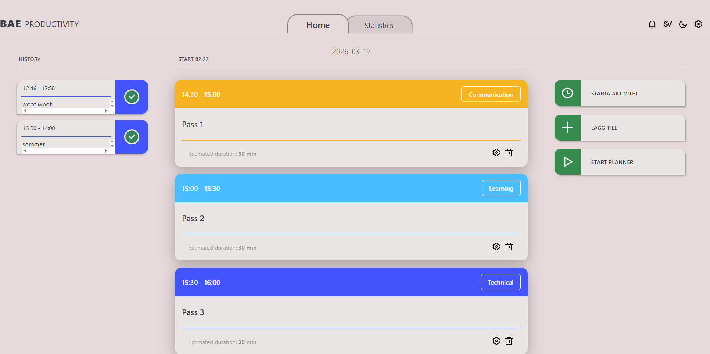

# BAE Productivity

En webapp som är till för att planera din arbetsdag. Där användaren får spara statistik och se vilka arbetsuppgifter som man utför effektivast på olika tidpunkter.

<a href="assets/screenshot.png">
  
</a>

---

##  Kom igång

```bash
git clone https://github.com/ollewarne/linkoping-pps.git
cd linkoping-pps
npm install
npm run dev
```

---

##  Teknikstack

| Teknik | Användning |
|---|---|
| React + Vite | UI-ramverk och byggverktyg |
| TypeScript | Typning |
| React Router | Routing |
| CSS Modules | Komponentspecifik styling |
| Context API | Global state-hantering |

---

##  Funktioner

- **Planerare** — Schemalägg aktiviteter med kategori och tidsblock
- **Timer** — Nedräkningstimer med arbets- och pausfaser
- **Statistik** — Logga energi, effektivitet och påverkande faktorer per session
- **Diagram** — Visualisera produktivitet, energi och tid med diagram
- **Dark/Light mode** — Temabyte med persistent lagring
- **Flerspråksstöd** — Svenska och engelska
- **Responsiv** — Anpassad layout för mobil och desktop

---

##  Grupp

| Namn | Roll |
|---|---|
| Delzar Kafashi | [Roll/ansvar] |
| Ingrid Berggren | [Roll/ansvar] |
| Mattias Ingvaldsson | [Roll/ansvar] |
| Mårten Mattsson | PauseStatistics, PopupManager, Context |
| Olle Warne | [Roll/ansvar] |

---

##  Länkar

- 🎨 [Figma-design](https://www.figma.com/design/LLT8LTSUv6xViAcIEapONv/PPS?node-id=0-1) *(Kan skilja sig från slutresultatet)*